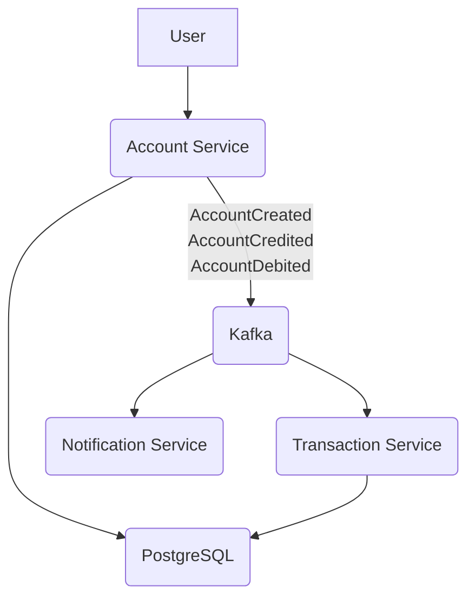

# Simple Banking Application

This is a microservices-based simple banking application.

## Overview

The application is composed of three microservices:
*   **Account Service**: Manages accounts and their balances.
*   **Transaction Service**: Handles credit and debit transactions.
*   **Notification Service**: Sends notifications for account activities.

These services communicate with each other asynchronously using Apache Kafka.

## Architecture

The application uses the following architecture:



## Services

### Account Service
*   Manages user accounts.
*   Provides endpoints to create accounts, and credit/debit an account.
*   Publishes events to Kafka when an account is created, credited, or debited.

### Transaction Service
*   Listens for account events from Kafka.
*   Records all transactions in the database.

### Notification Service
*   Listens for account events from Kafka.
*   Logs notification messages for account activities.

## Technologies Used

*   Java 17
*   Spring Boot 3
*   PostgreSQL
*   Apache Kafka
*   Docker & Docker Compose
*   Gradle

## How to Run

1.  **Prerequisites**:
    *   Docker and Docker Compose must be installed.

2.  **Build the application**:
    ```bash
    ./gradlew build --exclude-task test
    ```

3.  **Run the application**:
    ```bash
    sudo docker-compose up -d --build
    ```

The services will be available at the following ports:
*   Account Service: `8080`
*   Transaction Service: `8081`
*   Notification Service: `8082` 